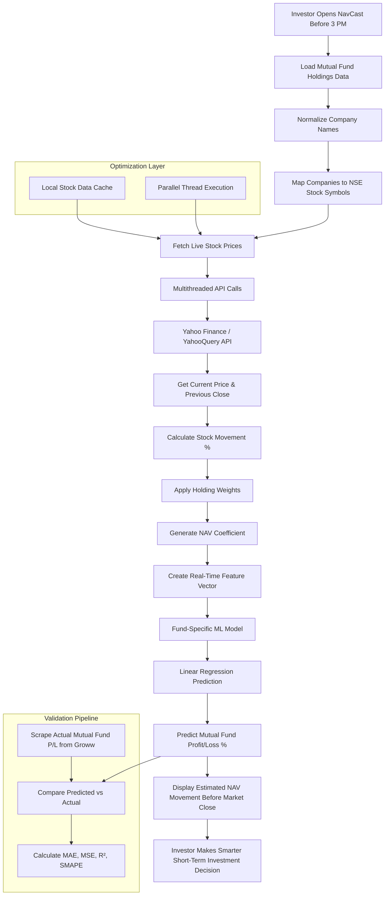
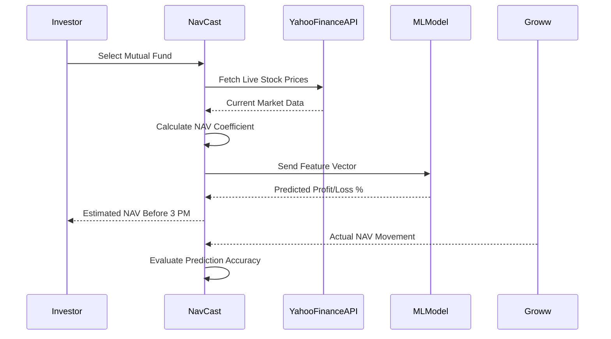

# Navcast

```mermaid
flowchart TD

    A[Investor Opens NavCast Before 3 PM] --> B[Load Mutual Fund Holdings Data]

    B --> C[Normalize Company Names]
    C --> D[Map Companies to NSE Stock Symbols]

    D --> E[Fetch Live Stock Prices]
    
    E --> F[Multithreaded API Calls]
    F --> G[Yahoo Finance / YahooQuery API]

    G --> H[Get Current Price & Previous Close]

    H --> I[Calculate Stock Movement %]

    I --> J[Apply Holding Weights]

    J --> K[Generate NAV Coefficient]

    K --> L[Create Real-Time Feature Vector]

    L --> M[Fund-Specific ML Model]

    M --> N[Linear Regression Prediction]

    N --> O[Predict Mutual Fund Profit/Loss %]

    O --> P[Display Estimated NAV Movement Before Market Close]

    P --> Q[Investor Makes Smarter Short-Term Investment Decision]


    subgraph Optimization Layer
        R[Local Stock Data Cache]
        S[Parallel Thread Execution]
    end

    R --> E
    S --> E


    subgraph Validation Pipeline
        T[Scrape Actual Mutual Fund P/L from Groww]
        U[Compare Predicted vs Actual]
        V[Calculate MAE, MSE, R², SMAPE]
    end

    O --> U
    T --> U
    U --> V
```

```mermaid
sequenceDiagram

    participant Investor
    participant NavCast
    participant YahooFinanceAPI
    participant MLModel
    participant Groww

    Investor->>NavCast: Select Mutual Fund

    NavCast->>YahooFinanceAPI: Fetch Live Stock Prices

    YahooFinanceAPI-->>NavCast: Current Market Data

    NavCast->>NavCast: Calculate NAV Coefficient

    NavCast->>MLModel: Send Feature Vector

    MLModel-->>NavCast: Predicted Profit/Loss %

    NavCast-->>Investor: Estimated NAV Before 3 PM

    Groww-->>NavCast: Actual NAV Movement

    NavCast->>NavCast: Evaluate Prediction Accuracy
```
