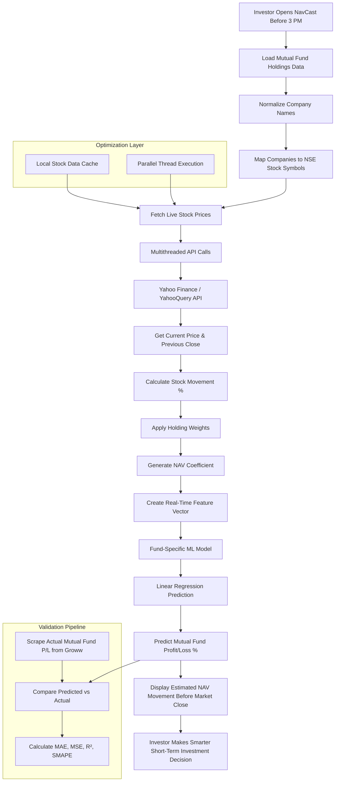
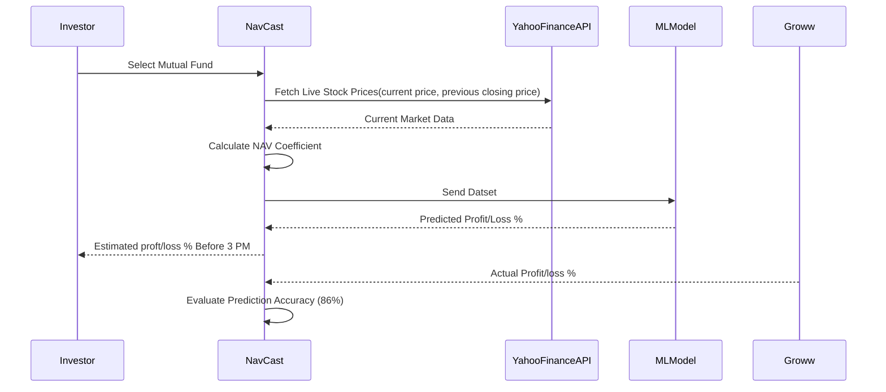
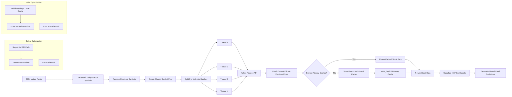
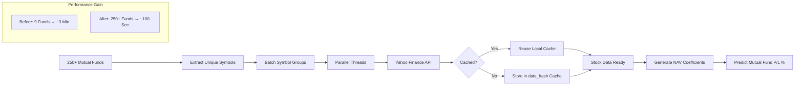

# Navcast

```mermaid
flowchart TD

    A[Investor Opens NavCast Before 3 PM] --> B[Load Mutual Fund Holdings Data]

    B --> C[Normalize Company Names]
    C --> D[Map Companies to NSE Stock Symbols]

    D --> E[Fetch Live Stock Prices]
    
    E --> F[Multithreaded API Calls]
    F --> G[Yahoo Finance / YahooQuery API]

    G --> H[Get Current Price & Previous Close]

    H --> I[Calculate Stock Movement %]

    I --> J[Apply Holding Weights]

    J --> K[Generate NAV Coefficient]

    K --> L[Create Real-Time Feature Vector]

    L --> M[Fund-Specific ML Model]

    M --> N[Linear Regression Prediction]

    N --> O[Predict Mutual Fund Profit/Loss %]

    O --> P[Display Estimated NAV Movement Before Market Close]

    P --> Q[Investor Makes Smarter Short-Term Investment Decision]


    subgraph Optimization Layer
        R[Local Stock Data Cache]
        S[Parallel Thread Execution]
    end

    R --> E
    S --> E


    subgraph Validation Pipeline
        T[Scrape Actual Mutual Fund P/L from Groww]
        U[Compare Predicted vs Actual]
        V[Calculate MAE, MSE, R², SMAPE]
    end

    O --> U
    T --> U
    U --> V
```

```mermaid
sequenceDiagram

    participant Investor
    participant NavCast
    participant YahooFinanceAPI
    participant MLModel
    participant Groww

    Investor->>NavCast: Select Mutual Fund

    NavCast->>YahooFinanceAPI: Fetch Live Stock Prices(current price, previous closing price)

    YahooFinanceAPI-->>NavCast: Current Market Data

    NavCast->>NavCast: Calculate NAV Coefficient

    NavCast->>MLModel: Send Datset

    MLModel-->>NavCast: Predicted Profit/Loss %

    NavCast-->>Investor: Estimated proft/loss % Before 3 PM

    Groww-->>NavCast: Actual Profit/loss %

    NavCast->>NavCast: Evaluate Prediction Accuracy (86%)
```

```mermaid
flowchart LR

    A[250+ Mutual Funds] --> B[Extract All Unique Stock Symbols]

    B --> C[Remove Duplicate Symbols]

    C --> D[Create Shared Symbol Pool]


    D --> E[Split Symbols into Batches]

    E --> F[Thread 1]
    E --> G[Thread 2]
    E --> H[Thread 3]
    E --> I[Thread N]


    F --> J[Yahoo Finance API]
    G --> J
    H --> J
    I --> J


    J --> K[Fetch Current Price & Previous Close]


    K --> L{Symbol Already Cached?}


    L -->|Yes| M[Reuse Cached Stock Data]

    L -->|No| N[Store Response in Local Cache]


    N --> O[data_hash Dictionary Cache]

    M --> P[Return Stock Data]

    O --> P


    P --> Q[Calculate NAV Coefficients]

    Q --> R[Generate Mutual Fund Predictions]


    subgraph Before Optimization
        S[Sequential API Calls]
        T[9 Mutual Funds]
        U[~3 Minutes Runtime]
    end


    subgraph After Optimization
        V[Multithreading + Local Cache]
        W[250+ Mutual Funds]
        X[~100 Seconds Runtime]
    end


    S --> U
    V --> X
```

```mermaid
flowchart LR

    A[250+ Mutual Funds]
    --> B[Extract Unique Symbols]
    --> C[Batch Symbol Groups]
    --> D[Parallel Threads]
    --> E[Yahoo Finance API]
    --> F{Cached?}

    F -->|Yes| G[Reuse Local Cache]
    F -->|No| H[Store in data_hash Cache]

    G --> I[Stock Data Ready]
    H --> I

    I --> J[Generate NAV Coefficients]
    J --> K[Predict Mutual Fund P/L %]


    subgraph Performance Gain
        L[Before: 9 Funds → ~3 Min]
        M[After: 250+ Funds → ~100 Sec]
    end
```
