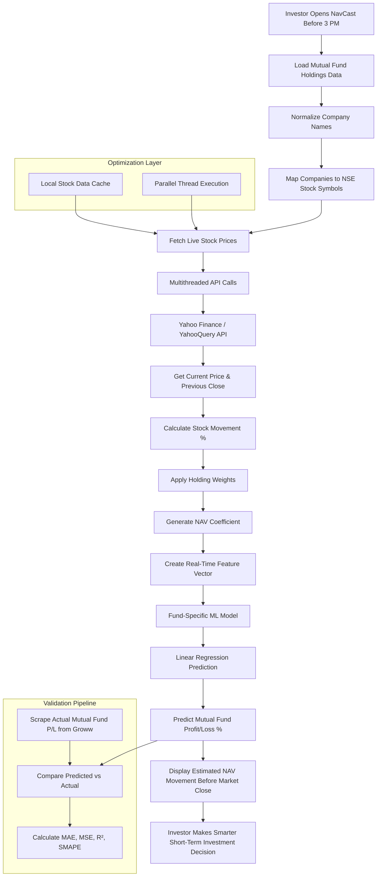
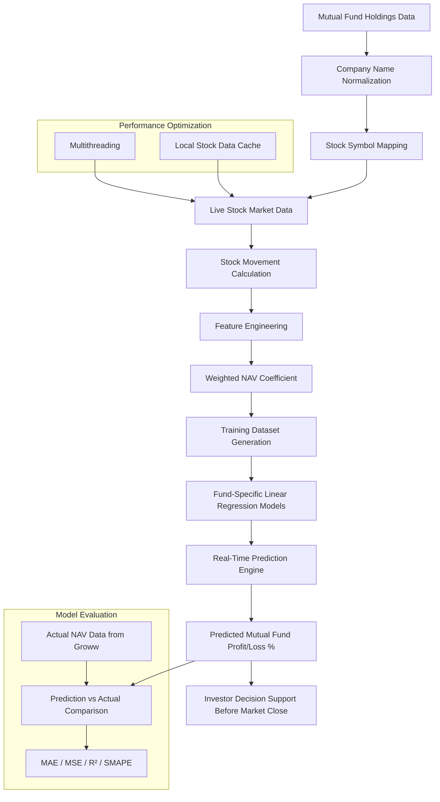

# Navcast

```mermaid
flowchart TD

    A[Investor Opens NavCast Before 3 PM] --> B[Load Mutual Fund Holdings Data]

    B --> C[Normalize Company Names]
    C --> D[Map Companies to NSE Stock Symbols]

    D --> E[Fetch Live Stock Prices]
    
    E --> F[Multithreaded API Calls]
    F --> G[Yahoo Finance / YahooQuery API]

    G --> H[Get Current Price & Previous Close]

    H --> I[Calculate Stock Movement %]

    I --> J[Apply Holding Weights]

    J --> K[Generate NAV Coefficient]

    K --> L[Create Real-Time Feature Vector]

    L --> M[Fund-Specific ML Model]

    M --> N[Linear Regression Prediction]

    N --> O[Predict Mutual Fund Profit/Loss %]

    O --> P[Display Estimated NAV Movement Before Market Close]

    P --> Q[Investor Makes Smarter Short-Term Investment Decision]


    subgraph Optimization Layer
        R[Local Stock Data Cache]
        S[Parallel Thread Execution]
    end

    R --> E
    S --> E


    subgraph Validation Pipeline
        T[Scrape Actual Mutual Fund P/L from Groww]
        U[Compare Predicted vs Actual]
        V[Calculate MAE, MSE, R², SMAPE]
    end

    O --> U
    T --> U
    U --> V
```

```mermaid
flowchart TD

    A[Mutual Fund Holdings Data] --> B[Company Name Normalization]

    B --> C[Stock Symbol Mapping]

    C --> D[Live Stock Market Data]

    D --> E[Stock Movement Calculation]

    E --> F[Feature Engineering]

    F --> G[Weighted NAV Coefficient]

    G --> H[Training Dataset Generation]

    H --> I[Fund-Specific Linear Regression Models]

    I --> J[Real-Time Prediction Engine]

    J --> K[Predicted Mutual Fund Profit/Loss %]

    K --> L[Investor Decision Support Before Market Close]


    subgraph Performance Optimization
        M[Multithreading]
        N[Local Stock Data Cache]
    end

    M --> D
    N --> D


    subgraph Model Evaluation
        O[Actual NAV Data from Groww]
        P[Prediction vs Actual Comparison]
        Q[MAE / MSE / R² / SMAPE]
    end

    K --> P
    O --> P
    P --> Q
```
